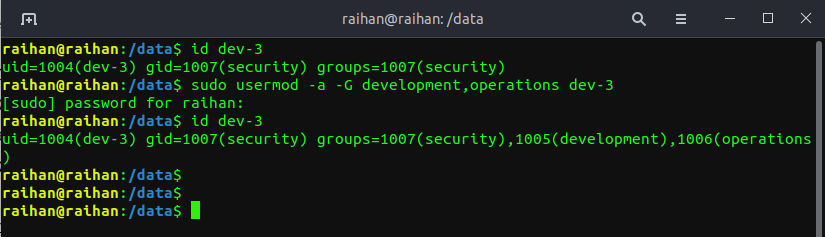

> As we've stated before, Linux is inherently a multi-user system, especially in the context of
a Linux server, where these systems are often administered not by a single user, but often a
(large) team. Each user on a server has it own set of permissions. Imagine, for example, a
server where three departments need to be development, operations, and security.
Development and operations both have their own stuff there, but also need to share some
other things. The security department needs to be able to view everything to ensure proper
compliance and adherence to security guidelines.
>

```
sudo useradd dev-1
sudo useradd dev-2
sudo useradd dev-3
```

## now we have the users in place, but we need shared groups. For this, we have a similar command (both in name and operation): groupadd . Check the man page for groupadd and add three groups corresponding to our departments:

```
sudo groupadd development
sudo groupadd operations
sudo groupadd security
```

## We will add the user to the group.
<hr>

### SYNTAX
```
usermod -g <groupname> <username>
```
```
sudo usermod -g development dev-1
sudo usermod -g operations dev-2
sudo usermod -g security dev-3
```


## we have only ensured that multiple developers can share files by all being in the development group

```
sudo mkdir /data
cd /data
sudo mkdir dev-files
sudo mkdir ops-files
sudo mkdir devops-files

```


## We now have the following structure: a ```/data/``` top level directory, which contains the directories ```dev-files``` and ```ops-files``` , which are owned by the `development` and `operations` groups, respectively. Now, let's fulfill the requirement that security can go into both directories and manage the files! Apart from using usermod to change the main groups, we can also append users to extra groups. In this case, the syntax is ``` usermod -a -G < groupnames > < username > ``` Let's add dev-3 to the ```development``` and ```operations``` groups:

```
sudo usermod -a -G development,operations dev-3
```

