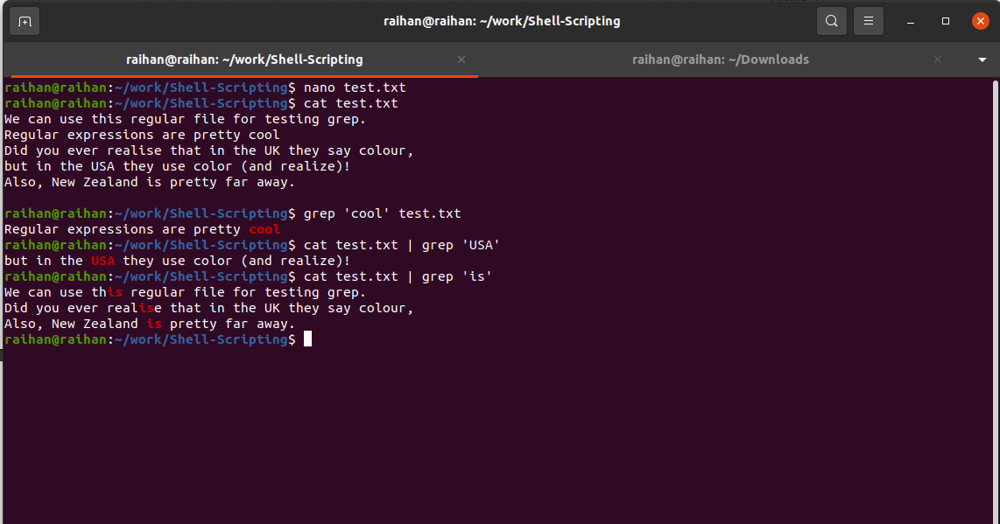

# Regular Expressins

> A nicely tailored regular expression can really help you keep your scripts short, simple, and robust to changes in the future.

## What is a regular expression?

In essence, a regular expression is a piece of text that functions as a search pattern for other
text. Regular expressions make it possible to easily say, for example, that I want to select all
lines that contain a word that is five characters in length, or look for all files that end in
.log .

An example might help with your understanding. First, we need a command that we can
use to explore regular expressions. The most famous command used in Linux with regular
expressions is **grep** .

grep is an acronym meaning *global regular expression print* . As you can see, this seems like a good candidate for explaining the concept!

