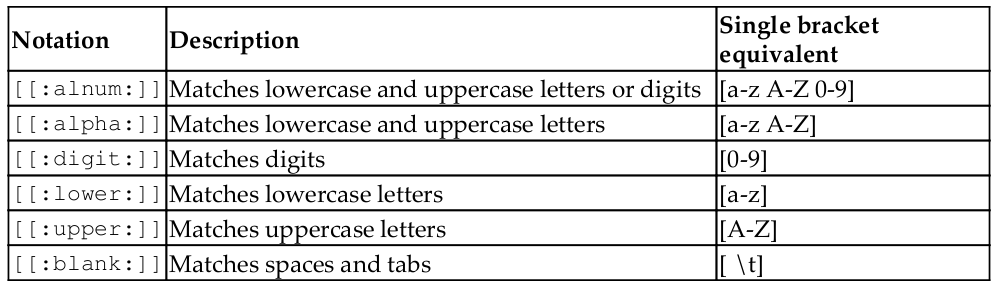

# Regular Expressins


> A nicely tailored regular expression can really help you keep your scripts short, simple, and robust to changes in the future.

## What is a regular expression?

In essence, a regular expression is a piece of text that functions as a search pattern for other
text. Regular expressions make it possible to easily say, for example, that I want to select all
lines that contain a word that is five characters in length, or look for all files that end in
.log .
<hr>

An example might help with your understanding. First, we need a command that we can
use to explore regular expressions. The most famous command used in Linux with regular
expressions is **grep** .
<hr>

grep is an acronym meaning *global regular expression print* . As you can see, this seems like a good candidate for explaining the concept!


```
grep -i 'regular' grep-file.txt
```
Uppercase and lowercase All of these results can be returned by supplying the -i flag to `grep` 

```
grep 'e.e' character-class.txt
```
In this example, we use the dot to substitute for any character. As we can see, this includes
both letters (eee) and numbers (e2e). However, it also matches the space character between
the two es on the last line.

```
grep 'aaa*' character-class.txt
```
When we use the * substitution, we're looking for zero or more instances of the preceding
character. In the search pattern aaa* , this means the following strings are valid:

- aa
- aaa
- aaaa
- aaaaa

## Character classes
```
grep [[:options:]] character-class.txt
```


<hr>
<hr>

# Globbing
There is another subject closely related to regular expressions on Linux: globbing. Even though you probably didn't realize it

## What is globbing?
Simply said, a glob pattern describes injecting a wildcard character into a file path operation. So, when you do a `cp * /tmp/` , you copy all files (not directories!) in the current working directory to the `/tmp/` directory.

The `*` expands to all regular files inside the working directory, and then all of those are
copied to `/tmp/` .

## Advanced grep
few popular options for grep to alter its default behavior: -- ignore-case ( -i ), --invert-match ( -v ), and --word-regexp ( -w ). As a reminder here's
what they do:

- -i allows us to search case-insensitively

- -v only prints lines that are not matched, instead of matched lines

- -w only matches on full words that are surrounded by spaces and/or line anchors and/or punctuation marks


https://tldp.org/LDP/abs/html/x17129.html