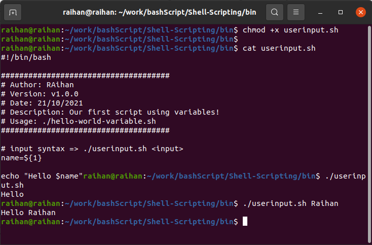

## What is a variable?
Variables are a standard building block used in many (if not all) programming and
scripting languages. Variables allow us to store information, so we can reference and use it later, often multiple times. We can, for example, use the `textvariable` variable to store the sentence `This text is contained in the variable` . In this case, the variable name of `textvariable` is referred to as the key, and the content of the variable (the text) is
referred to as the value, in the key-value pair that makes up the variable.

## variable syntax 

```
#string
hello_text="Hello World!"

#integer
hello_int=1

#print variable
echo ${hello_text}
echo ${hello_int}
```

## Basic input
At a very basic level, everything that you put on the command line right after calling the
script can be used as input. However, it is up to the script to use it! For example, consider
the following situation:

```
#!/bin/bash

name=${1}

echo "Hello $name"
```
## Execute permission

```
chmod +x userinput.sh
```

## Run
```
$ ./userinput.sh Raihan
```
## Output
```
Hello Raihan
```



